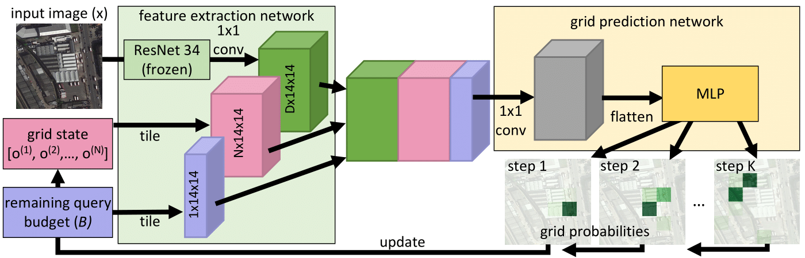

# A Visual Active Search Framework for Geospatial Exploration


This repository contains implementation of our work titled as __A Visual Active Search Framework for Geospatial Exploration__. VAS proposes a reinforcement learning framework to perform Visual Active Search. 



**PDF**: https://arxiv.org/pdf/2211.15788.pdf

**Authors**: Anindya Sarkar, Michael Lanier, Scott Alfeld, Roman Garnett, Nathan Jacobs, Yevgeniy Vorobeychik.

-------------------------------------------------------------------------------------
## Requirements
**Frameworks**: Our implementation uses **Python3.5** and **PyTorch-v1.4.0** framework.

**Packages**: You should install prerequisites using:
```shell
  pip install -r requirements.txt
```

**Datasets**:


**xView**: You can find the instructions to download images [here](https://challenge.xviewdataset.org/data-format). After downloading the images along with **xView_train.geojson**, you need to run the following script. It will generate a csv file containing the image-path and it's corresponding grid-label sequence. Don't forget to change the directory.

```shell
  python3 Prepare_data.py
```

## Training
**Train the VAS Policy Network**


To train the policy network on different benchmarks including **xView**, **DOTA** dataset:

```shell
  python3 vas.py
```

**Train the Greedy Selection Policy Network**


To train the greedy selection policy network on different benchmarks including **xView**, **DOTA** dataset:

```shell
  python3 greedy_selection.py
```

For questions or comments, please send an e-mail to **anindyasarkar.ece@gmail.com** or use the issue tab in github.

You can cite our paper as:
```
@article{sarkar2022visual,
  title={A Visual Active Search Framework for Geospatial Exploration},
  author={Sarkar, Anindya and Lanier, Michael and Alfeld, Scott and Garnett, Roman and Jacobs, Nathan and Vorobeychik, Yevgeniy},
  journal={arXiv preprint arXiv:2211.15788},
  year={2022}
}
```
